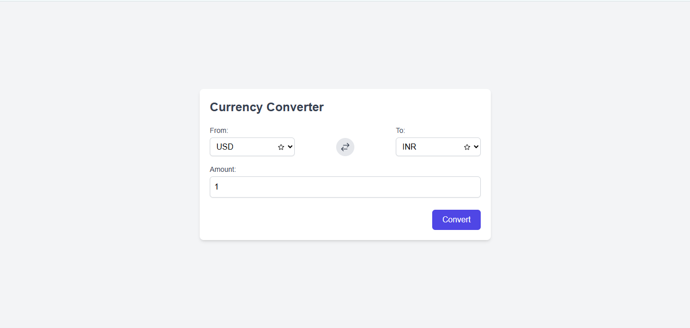

# 💱 Currency Converter - FE Capstone Project

A responsive web application built with **React, Vite, Tailwind CSS, and JavaScript** that allows users to convert between different currencies in real time using a public exchange rate API.  

This project simulates a **real-world frontend development workflow**, including API integration, state management, error handling, and deployment.

---

## ## 📸 Preview



---

## 🚀 Features
- 🔄 Convert amounts between different currencies in real time.
- 🌍 Supports multiple world currencies via a public API.
- 📊 Displays the current exchange rate for the selected currency pair.
- 📱 Responsive design for desktop, tablet, and mobile.
- ⚠️ Error handling for invalid inputs, network errors, and unsupported currencies.
- 🎨 Clean and modern UI built with Tailwind CSS.

---

## 🛠️ Tech Stack
- **React + Vite** → Fast development and optimized build.
- **Tailwind CSS** → Responsive styling and utility-first design.
- **JavaScript (ES6+)** → Logic and API integration.
- **ExchangeRate API (or similar)** → Real-time currency exchange rates.
- **Node.js + npm** → Package manager and development environment.

---

## ⚙️ Installation & Setup

1. Clone the repository:
   ```bash
   git clone https://github.com/username/currency-converter.git
   cd currency-converter
