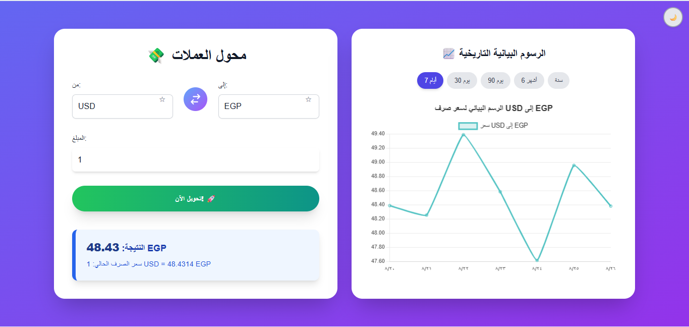
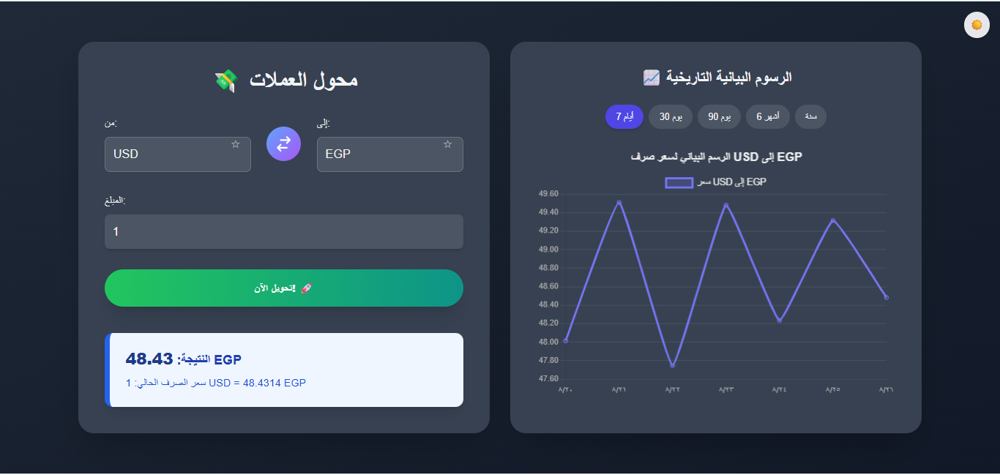

💱 Currency Converter - FE Capstone Project
A responsive web application built with React, Vite, Tailwind CSS, and JavaScript that allows users to convert between different currencies in real time using a public exchange rate API. 🌐

This project simulates a real-world frontend development workflow, including API integration, state management, error handling, and deployment.

📸 Preview
شاشة الترحيب بالمستخدم

واجهة محول العملات مع الرسم البياني

وضع الظلام لواجهة محول العملات

🚀 Features
Real-time Conversion 🔄: Convert amounts between different currencies in real time.

Global Currency Support 🌍: Supports multiple world currencies via a public API.

Exchange Rate Display 📊: Displays the current exchange rate for the selected currency pair.

Historical Charts 📈: Visualize exchange rate trends over different periods (7 days, 30 days, 90 days, 6 months, 1 year).

Favorite Currency Pairs ⭐: Save frequently used currency pairs for quick access, enhancing user convenience.

Dark Mode 🌙: Toggle between light and dark themes for improved readability and user preference.

Loading Skeletons ⏳: Provides elegant loading indicators while fetching data, improving perceived performance.

Enhanced Input Validation ⚠️: Offers immediate feedback for invalid amount inputs, preventing errors.

Responsive Design 📱: Optimized for desktop, tablet, and mobile viewing.

Robust Error Handling 🚨: Gracefully manages invalid inputs, network errors, and unsupported currencies with meaningful messages.

Modern UI/UX ✨: Clean, modern, and interactive user interface built with Tailwind CSS, featuring gradients, shadows, and smooth transitions.

🛠️ Tech Stack
React + Vite → Fast development and optimized build.

Tailwind CSS → Responsive styling and utility-first design.

JavaScript (ES6+) → Core logic and API integration.

Chart.js & React-Chartjs-2 → For interactive historical exchange rate charts.

ExchangeRate-API (or similar) → Real-time currency exchange rates.

Node.js + npm → Package manager and development environment.

localStorage → Client-side storage for user preferences (e.g., Dark Mode, Favorite Pairs).

⚙️ Installation & Setup
Clone the repository:

git clone https://github.com/youssifsaid1/Currency-Converter.git
cd currency-converter

Install dependencies:

npm install
# or if you use yarn
# yarn install

Get your API Key:

Sign up for a free account at ExchangeRate-API.

Obtain your unique API Key from your dashboard.

Configure your API Key:

Open the src/App.jsx file.

Locate the line const API_KEY = 'YOUR_EXCHANGERATE_API_KEY';

Replace 'YOUR_EXCHANGERATE_API_KEY' with your actual API Key:

const API_KEY = 'f7c29f7939a60abf4f665031'; // Example: Use your real API Key here

Run the development server:

npm run dev
# or if you use yarn
# yarn dev

The application will be accessible at http://localhost:5173 (or another port if 5173 is in use).

💡 Usage
Welcome Screen: On first load, you'll see a modern welcome screen. Click "ادخل التطبيق الآن ✨" to proceed to the converter.

Currency Conversion:

Select the "From" and "To" currencies from the dropdowns.

Enter the amount you wish to convert.

Click "تحويل الآن! 🚀" to see the converted amount and the current exchange rate.

Swap Currencies: Use the central swap button to quickly reverse the "From" and "To" currencies.

Favorite Pairs:

Click the "⭐" icon next to either currency dropdown to add the current currency pair to your favorites.

Click "⭐" again to remove it.

Favorite pairs will appear at the top of the currency dropdowns for easy selection.

Historical Charts:

After the initial conversion, a chart will appear next to the converter.

Select different periods (7 days, 30 days, etc.) to view historical exchange rate trends.

Dark Mode: Click the "☀️ / 🌙" toggle button in the top right corner to switch between light and dark themes. Your preference will be saved.

Error Messages: The app provides clear messages for invalid inputs or if there's an issue fetching exchange rates.

🚧 Limitations & Known Issues
Historical Data API (Mock Data): Currently, historical chart data is generated using a mock function within the application. For real-world historical data, integration with a dedicated historical exchange rate API (often a paid feature) would be required.

API Rate Limits: The free tier of ExchangeRate-API has usage limits. Frequent requests may lead to temporary API access issues.

Offline Functionality: The application requires an active internet connection to fetch real-time exchange rates.

Currency List: The list of supported currencies is manually defined. For a more dynamic approach, a separate API for currency codes could be integrated.

🤝 Contributing
Contributions are welcome! If you have suggestions for improvements or new features, please open an issue or submit a pull request.

License
This project is open source and available under the MIT License.